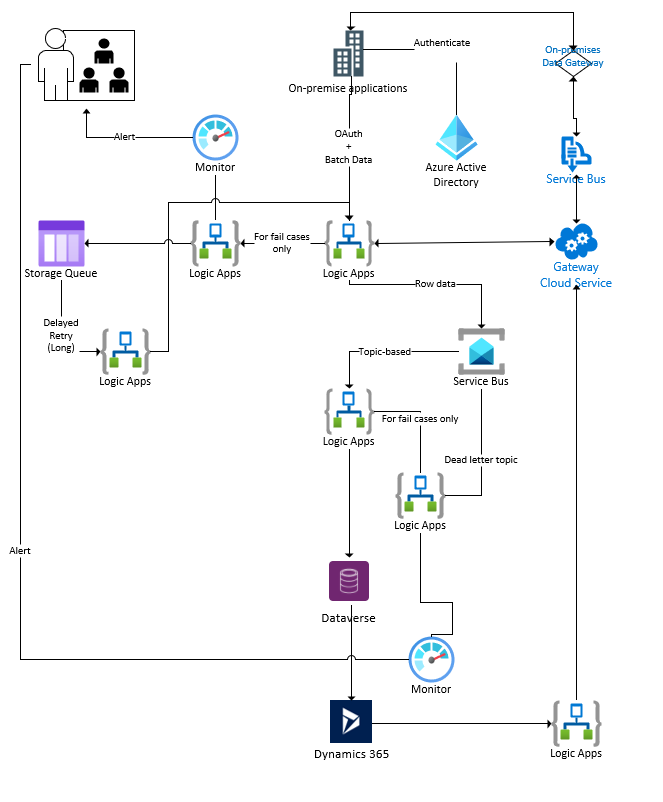

# Resilient processing of batch messages via Logic Apps with Queue Storage for 2-level Retry

An Azure architecture leveraging Azure Logic Apps to process batch data. Each item in a batch is placed in a Service Bus. Downstream Logic Apps will receive from queue/subscription using the [Service Bus](https://docs.microsoft.com/en-us/connectors/servicebus/) connector. Suitable for:

* Mediating between batch senders and single record receivers
* Throttling scenarios
* Handling bursts and scale

For resilience, explicit [Logic Apps Retry policies](https://docs.microsoft.com/en-us/azure/logic-apps/logic-apps-exception-handling) are recommended. For certain scenarios, there may be failed cases beyond technical/service level exceptions/errors. For such failed cases, a higher level handler via another set of Logic Apps leveraging Storage Queue / Service Bus is recommended. These failed cases may require further business logic and rules.

## Features

* Increased Resilience with Retry pattern leveraging Logic Apps’s first-class error handling policies and integration with Azure services such as Queue Storage (triggers available). 

* Queue-Based Load Leveling allows source systems to receive confirmation response for batch sent while processed data are further integrated downstream.

* Use of on-premises data gateway as a convenient way to create a bridge to allow quick data transfer between on premises systems and Azure Integration Services.
